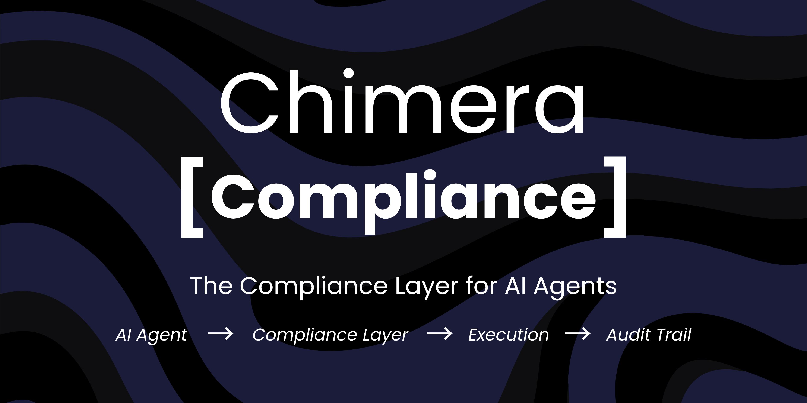

<p align="center">
  
</p>

<h1 align="center">chimera-compliance</h1>

<p align="center">
  <strong>EU AI Act compliance layer for AI agents</strong><br>
  Plug into any agent framework. Enforce deterministic policy guards. Audit every decision.
</p>

<p align="center">
  <a href="https://pypi.org/project/chimera-compliance/"></a>
  <a href="https://pypi.org/project/chimera-compliance/"></a>
  <a href="https://github.com/akarlaraytu/chimera-compliance/blob/main/LICENSE"></a>
  <a href="https://compliance.chimera-protocol.com"></a>
  <a href="https://pypi.org/project/csl-core/"></a>
</p>

<p align="center">
  <a href="#quickstart">Quickstart</a> &bull;
  <a href="#dashboard">Dashboard</a> &bull;
  <a href="#architecture">Architecture</a> &bull;
  <a href="#agent-framework-integrations">Integrations</a> &bull;
  <a href="#eu-ai-act-compliance">EU AI Act</a>
</p>

---

## What is chimera-compliance?

**chimera-compliance** is a plug-in compliance layer for AI agents. It wraps any agent framework (LangChain, LangGraph, LlamaIndex, CrewAI, AutoGen) with deterministic policy guards that **BLOCK**, **ALLOW**, or **ASK_HUMAN** before every action executes.

```
Agent Action --> Policy Guard --> BLOCK / ALLOW / ASK_HUMAN --> Audit Record
                    |
              Violation report + EU AI Act compliant audit trail
```

**Why?** AI agents in enterprise are hard to audit and hard to control. chimera-compliance solves this by binding agents to a deterministic runtime guard -- every tool call, every decision goes through policy evaluation before execution.

**Key properties:**

- **Deterministic safety** -- Policy constraints enforced via rules (or Z3 formal verification with CSL-Core)
- **Framework agnostic** -- Works with LangChain, LangGraph, LlamaIndex, CrewAI, AutoGen, or raw LLMs
- **Full audit trail** -- Every decision produces a complete JSON record (Art. 12)
- **Human oversight** -- Confirm, override, or halt at any point (Art. 14)
- **Right to explanation** -- One-click HTML reports for any decision (Art. 86)

## Quickstart

### Install

```bash
# Core (YAML rules, no Z3)
pip install chimera-compliance

# With CSL-Core for Z3 formal verification (recommended)
pip install chimera-compliance[csl]

# Everything
pip install chimera-compliance[all]
```

### Initialize a project

```bash
chimera-compliance init
```

This creates `.chimera/config.yaml` and a starter policy file.

### Write a policy

**Option A: YAML rules (no extra dependencies)**

```yaml
# policies/governance.yaml
rules:
  - name: manager_limit
    when: "role == 'MANAGER' and amount > 250000"
    then: BLOCK
    message: "Managers cannot approve more than $250,000"
  - name: weekend_freeze
    when: "is_weekend == 'YES' and urgency != 'CRITICAL'"
    then: BLOCK
    message: "No changes on weekends unless critical"
```

**Option B: CSL policy (requires `chimera-compliance[csl]`)**

```text
CONFIG {
  ENFORCEMENT_MODE: BLOCK
}

DOMAIN GovernanceGuard {
  VARIABLES {
    amount: 0..1000000
    role: {"ANALYST", "MANAGER", "DIRECTOR", "VP", "CEO"}
  }

  STATE_CONSTRAINT manager_approval_limit {
    WHEN role == "MANAGER"
    THEN amount <= 250000
  }
}
```

### Run the agent

```bash
export CHIMERA_OPENAI_API_KEY=sk-...
chimera-compliance run
```

### Verify a policy

```bash
chimera-compliance verify policies/governance.csl
```

## Dashboard

**chimera-compliance** comes with a full-featured compliance dashboard at **[compliance.chimera-protocol.com](https://compliance.chimera-protocol.com)**.

<p align="center">
  
</p>

**Real-time audit monitoring** -- Live feed of agent decisions with ALLOW/BLOCK/ESCALATE status, EU AI Act compliance score, and top violations.

<p align="center">
  
</p>

**Policy management** -- Create, edit, and verify CSL/YAML policies with Z3 formal verification. View constraints, variables, and policy hashes.

<p align="center">
  
</p>

**Analytics** -- Decision trends, block rate heatmaps, and violation frequency across all agents.

<p align="center">
  
</p>

**Connect Agent** -- 4-step wizard to integrate compliance guard into LangChain, LangGraph, CrewAI, LlamaIndex, or AutoGen.

## Agent Framework Integrations

### LangChain

```python
from langchain_openai import ChatOpenAI
from chimera_compliance.integrations.langchain import wrap_tools, ChimeraCallbackHandler

# Wrap your tools with compliance guard
guarded_tools = wrap_tools(your_tools, policy="./policies/governance.yaml")

# Or use callback handler
handler = ChimeraCallbackHandler(policy="./policies/governance.yaml")
llm = ChatOpenAI(callbacks=[handler])
```

### LangGraph

```python
from chimera_compliance.integrations.langgraph import compliance_node

# Add a compliance gate node to your graph
graph.add_node("compliance_check", compliance_node(policy="./policies/governance.yaml"))
```

### CrewAI

```python
from chimera_compliance.integrations.crewai import wrap_crew_tools

guarded_tools = wrap_crew_tools(your_tools, policy="./policies/governance.yaml")
```

### Raw LLM (direct)

```python
from chimera_compliance import ChimeraAgent

agent = ChimeraAgent(
    model="gpt-4o",
    api_key="sk-...",
    policy="./policies/governance.csl",
)

result = agent.decide(
    "Approve $200k marketing spend for Q3",
    context={"role": "MANAGER", "department": "MARKETING"},
)

print(result.result)       # "ALLOWED"
print(result.action)       # "Allocate $200k to digital channels"
```

## CLI Reference

| Command | Description |
|---------|-------------|
| `chimera-compliance init` | Initialize project with config and starter policy |
| `chimera-compliance run` | Interactive agent with real-time reasoning display |
| `chimera-compliance run --daemon` | Pipe mode for JSON stdin/stdout |
| `chimera-compliance stop [--force]` | Graceful or immediate halt |
| `chimera-compliance verify [POLICY]` | Verify CSL policy (syntax + Z3 + IR) |
| `chimera-compliance test [--skip-llm]` | End-to-end system test |
| `chimera-compliance audit --stats` | Aggregate decision statistics |
| `chimera-compliance audit --last 10` | Recent decisions table |
| `chimera-compliance audit --export FILE` | Export records (json/compact/stats) |
| `chimera-compliance policy new NAME` | Create policy from template |
| `chimera-compliance policy list` | List and verify all policies |
| `chimera-compliance policy simulate FILE '{"k":"v"}'` | Test policy against input |
| `chimera-compliance explain --id ID` | Generate Art. 86 HTML explanation |
| `chimera-compliance docs generate` | Generate Annex IV documentation |
| `chimera-compliance license status` | Show current license tier and details |
| `chimera-compliance license activate KEY` | Activate a license |
| `chimera-compliance license deactivate` | Remove license key |

## EU AI Act Compliance

| Article | Requirement | Implementation |
|---------|-------------|----------------|
| Art. 9 | Risk management | Formal verification (Z3) or rule-based policy evaluation |
| Art. 12 | Record-keeping | Complete DecisionAuditRecord for every decision |
| Art. 13 | Transparency | Right to explanation, audit queries, HTML reports |
| Art. 14 | Human oversight | Confirm/override/halt with full audit trail |
| Art. 15 | Accuracy & security | Deterministic policy gate, API key protection |
| Art. 19 | Retention | Configurable retention with automatic enforcement |
| Art. 86 | Right to explanation | Self-contained HTML reports per decision |
| Annex IV | Technical documentation | Auto-generated 14/19 sections |

## Supported Providers & Frameworks

| Integration | Install | Notes |
|-------------|---------|-------|
| LangChain | `pip install chimera-compliance[langchain]` | Tool wrapper + callback handler |
| LangGraph | `pip install chimera-compliance[langgraph]` | Node guard + state checkpoint |
| LlamaIndex | `pip install chimera-compliance[llamaindex]` | Tool spec + callback handler |
| CrewAI | `pip install chimera-compliance[crewai]` | Tool wrapper for crews |
| AutoGen | `pip install chimera-compliance[autogen]` | Agent wrapper |
| OpenAI | `pip install chimera-compliance[openai]` | gpt-4o, gpt-4o-mini, o1, o3 |
| Anthropic | `pip install chimera-compliance[anthropic]` | claude-sonnet-4-20250514, claude-opus-4-20250514 |
| Google | `pip install chimera-compliance[google]` | gemini-2.0-flash, gemini-2.5-pro |
| Ollama | `pip install chimera-compliance[ollama]` | llama3, mistral, qwen (local) |
| CSL-Core | `pip install chimera-compliance[csl]` | Z3 formal verification |

## Development

```bash
git clone https://github.com/akarlaraytu/chimera-compliance
cd chimera-compliance
pip install -e ".[dev,all]"
pytest tests/ -v
```

## Related Projects

- **[CSL-Core](https://pypi.org/project/csl-core/)** -- Chimera Specification Language compiler and runtime
- **[Chimera Compliance Dashboard](https://compliance.chimera-protocol.com)** -- EU AI Act compliance dashboard

## License

Apache License 2.0 -- see [LICENSE](LICENSE) for details.

---

<p align="center">
  <strong>Building AI Governance.</strong><br>
  <sub>Built by <a href="https://github.com/akarlaraytu">Aytug Akarlar</a></sub>
</p>
