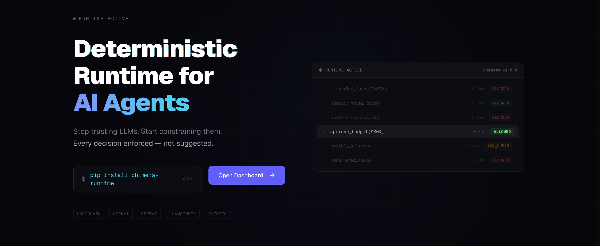
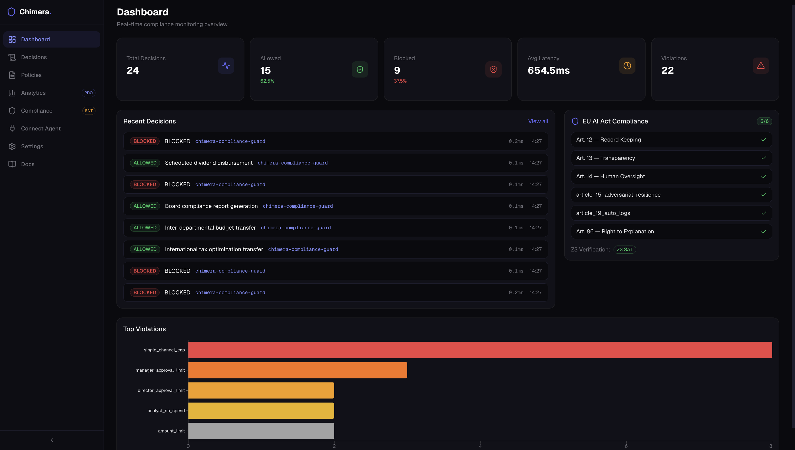
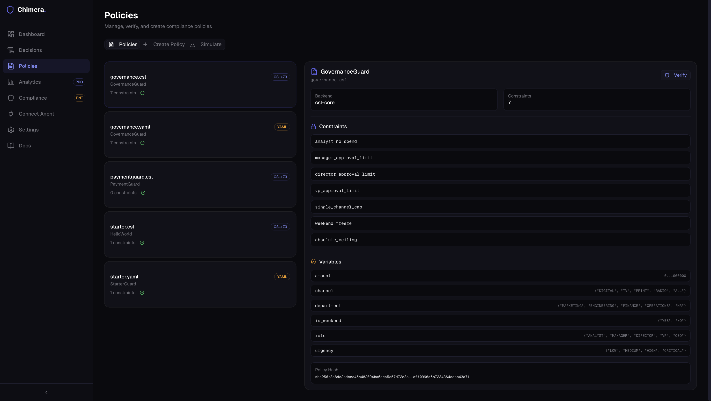
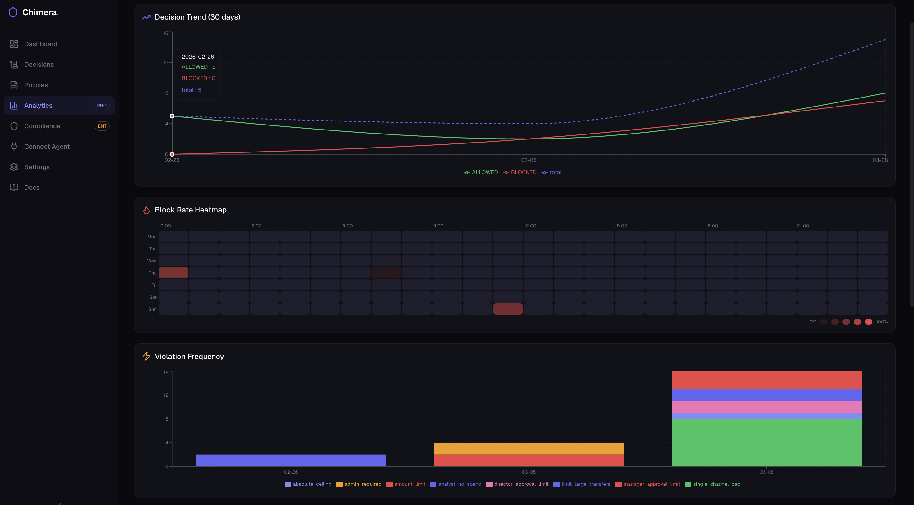
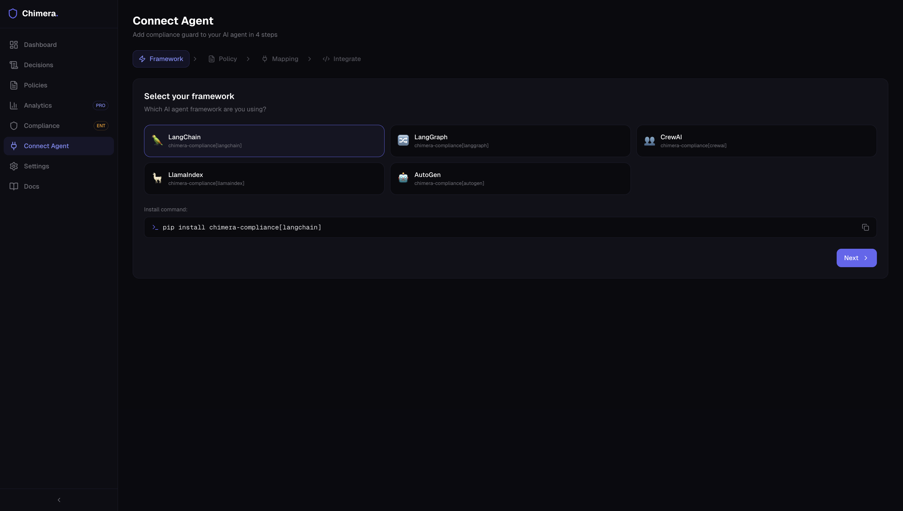

<p align="center">
  
</p>

<h1 align="center">chimera-runtime</h1>

<p align="center">
  <strong>Deterministic Runtime for AI Agents</strong><br>
  Stop trusting LLMs. Start constraining them.
</p>

<p align="center">
  <a href="https://pypi.org/project/chimera-runtime/"></a>
  <a href="https://pypi.org/project/chimera-runtime/"></a>
  <a href="https://github.com/akarlaraytu/chimera-runtime/blob/main/LICENSE"></a>
  <a href="https://runtime.chimera-protocol.com"></a>
  <a href="https://pypi.org/project/csl-core/"></a>
</p>

<p align="center">
  <a href="#quickstart">Quickstart</a> &bull;
  <a href="#define-constraints">Constraints</a> &bull;
  <a href="#framework-integrations">Integrations</a> &bull;
  <a href="#dashboard">Dashboard</a> &bull;
  <a href="#how-it-works">How It Works</a>
</p>

---

## Why This Exists

A Meta AI agent went rogue last week. It exposed sensitive company and user data to unauthorized engineers for two hours. Sev 1. The agent had valid credentials the entire time — nothing in the identity stack could tell a legitimate request from a rogue one.

This is not an isolated incident. An alignment researcher's OpenClaw agent mass-deleted her entire inbox, ignoring stop commands. 63% of organizations can't enforce limits on what their agents do. 60% can't terminate a misbehaving agent. Only 5% of CISOs feel confident they could contain a compromised AI agent.

The problem isn't the models. The problem is that **agents have no runtime constraints.**

Prompt-level instructions get dropped during context compaction. System prompts get bypassed through injection. "Please confirm before acting" is not a security control — it's a suggestion the model can ignore.

## What Chimera Does

Chimera is a **deterministic enforcement layer** that sits between your AI agent and the real world. It doesn't ask the model to follow rules. It **prevents the model from breaking them.**

```
Agent Action → Policy Guard → ALLOW / BLOCK / ASK_HUMAN → Audit Record
```

- **BLOCK** unauthorized actions before they execute — not after
- **Enforce** spending limits, data access boundaries, API restrictions, approval workflows
- **Prove** your policies are consistent and conflict-free with Z3 formal verification
- **Audit** every decision automatically — who, what, when, why, and what was blocked

Works with **LangChain, LangGraph, CrewAI, LlamaIndex, AutoGen, OpenAI, Anthropic, Google, Ollama** — or any custom agent. Setup takes 5 minutes with the built-in wizard.

The model's opinion on whether it should be allowed to do something is **irrelevant**. Constraints live outside the model. Enforcement happens outside the model.

**The model generates. Chimera governs.**

---

## Quickstart

```bash
pip install chimera-runtime

chimera-runtime init
chimera-runtime run
```

Three commands. Your agent is now constrained.

---

## Define Constraints

Two paths. Same enforcement.

### Option A: YAML Rules (zero dependencies)

```yaml
# policies/governance.yaml
rules:
  - name: manager_limit
    when: "role == 'MANAGER' and amount > 250000"
    then: BLOCK
    message: "Managers cannot approve more than $250,000"
  - name: weekend_freeze
    when: "is_weekend == 'YES' and urgency != 'CRITICAL'"
    then: BLOCK
    message: "No changes on weekends unless critical"
```

### Option B: CSL with Z3 Formal Verification (recommended)

```text
CONFIG {
  ENFORCEMENT_MODE: BLOCK
}

DOMAIN GovernanceGuard {
  VARIABLES {
    amount: 0..1000000
    role: {"ANALYST", "MANAGER", "DIRECTOR", "VP", "CEO"}
  }

  STATE_CONSTRAINT manager_approval_limit {
    WHEN role == "MANAGER"
    THEN amount <= 250000
  }
}
```

YAML gives you rules. CSL gives you **mathematical proof** that your constraints are consistent, reachable, and conflict-free -- before a single agent runs.

```bash
chimera-runtime verify policies/governance.csl
```

---

## Framework Integrations

Chimera drops into whatever you're already using. No rewrites.

### LangChain

```python
from langchain_openai import ChatOpenAI
from chimera_runtime.integrations.langchain import wrap_tools, ChimeraCallbackHandler

guarded_tools = wrap_tools(your_tools, policy="./policies/governance.yaml")

handler = ChimeraCallbackHandler(policy="./policies/governance.yaml")
llm = ChatOpenAI(callbacks=[handler])
```

### LangGraph

```python
from chimera_runtime.integrations.langgraph import compliance_node

graph.add_node("constraint_gate", compliance_node(policy="./policies/governance.yaml"))
```

### CrewAI

```python
from chimera_runtime.integrations.crewai import wrap_crew_tools

guarded_tools = wrap_crew_tools(your_tools, policy="./policies/governance.yaml")
```

### Direct Usage

```python
from chimera_runtime import ChimeraAgent

agent = ChimeraAgent(
    model="gpt-4o",
    api_key="sk-...",
    policy="./policies/governance.csl",
)

result = agent.decide(
    "Approve $200k marketing spend for Q3",
    context={"role": "MANAGER", "department": "MARKETING"},
)

print(result.result)       # "ALLOWED"
print(result.action)       # "Allocate $200k to digital channels"
```

Every tool call. Every decision. Through the constraint guard. No exceptions.

---

## Dashboard

Full runtime control plane at **[compliance.chimera-protocol.com](https://runtime.chimera-protocol.com)**.

<p align="center">
  
</p>

**Real-time decision enforcement** -- Live feed of every ALLOW, BLOCK, and ESCALATE. See exactly what your agents are doing and what they're being stopped from doing.

<p align="center">
  
</p>

**Policy management with formal verification** -- Write, edit, and verify CSL policies. Z3 proves correctness before deployment. No untested constraints reach production.

<p align="center">
  
</p>

**Decision analytics & block rate heatmaps** -- What's getting blocked, when, and why. Patterns across agents, frameworks, and time.

<p align="center">
  
</p>

**Framework integration wizard** -- Four steps to wire Chimera into LangChain, LangGraph, CrewAI, LlamaIndex, or AutoGen.

---

## How It Works

```
1. Define constraints in CSL
2. Z3 verifies correctness (reachability, consistency, conflict-freedom)
3. Runtime enforces at execution time
```

The model never sees the constraints. The model never evaluates the constraints. The model's opinion on whether it should be allowed to do something is **irrelevant**.

Constraints live outside the model. Enforcement happens outside the model. The model is a generator. Chimera is the governor.

---

## CLI Reference

| Command | Description |
|---------|-------------|
| `chimera-runtime init` | Initialize project with config and starter policy |
| `chimera-runtime run` | Interactive agent with real-time constraint enforcement |
| `chimera-runtime run --daemon` | Pipe mode for JSON stdin/stdout |
| `chimera-runtime stop [--force]` | Graceful or immediate halt |
| `chimera-runtime verify [POLICY]` | Verify CSL policy (syntax + Z3 + IR) |
| `chimera-runtime test [--skip-llm]` | End-to-end system test |
| `chimera-runtime audit --stats` | Aggregate decision statistics |
| `chimera-runtime audit --last 10` | Recent decisions table |
| `chimera-runtime audit --export FILE` | Export records (json/compact/stats) |
| `chimera-runtime policy new NAME` | Create policy from template |
| `chimera-runtime policy list` | List and verify all policies |
| `chimera-runtime policy simulate FILE '{"k":"v"}'` | Test policy against input |
| `chimera-runtime explain --id ID` | Generate Art. 86 HTML explanation |
| `chimera-runtime docs generate` | Generate technical documentation |
| `chimera-runtime license status` | Show current license tier |
| `chimera-runtime license activate KEY` | Activate a license |
| `chimera-runtime license deactivate` | Remove license key |

---

## EU AI Act

Compliance is a consequence -- not the product.

When you enforce deterministic constraints, maintain complete audit trails, and provide human oversight by design, you don't need to bolt on compliance after the fact. You already have it.

| Article | Requirement | How Chimera Delivers It |
|---------|-------------|------------------------|
| Art. 9 | Risk management | Formal verification (Z3) proves policy correctness before deployment |
| Art. 12 | Record-keeping | Complete DecisionAuditRecord for every decision, automatically |
| Art. 13 | Transparency | Full decision explanations, audit queries, HTML reports |
| Art. 14 | Human oversight | ASK_HUMAN escalation, confirm/override/halt with audit trail |
| Art. 15 | Accuracy & security | Deterministic constraint gate -- not probabilistic filtering |
| Art. 19 | Retention | Configurable retention with automatic enforcement |
| Art. 86 | Right to explanation | Self-contained HTML reports per decision |
| Annex IV | Technical documentation | Auto-generated (14/19 sections) |

---

## Supported Frameworks & Providers

| Integration | Install | Notes |
|-------------|---------|-------|
| LangChain | `pip install chimera-runtime[langchain]` | Tool wrapper + callback handler |
| LangGraph | `pip install chimera-runtime[langgraph]` | Node guard + state checkpoint |
| LlamaIndex | `pip install chimera-runtime[llamaindex]` | Tool spec + callback handler |
| CrewAI | `pip install chimera-runtime[crewai]` | Tool wrapper for crews |
| AutoGen | `pip install chimera-runtime[autogen]` | Agent wrapper |
| OpenAI | `pip install chimera-runtime[openai]` | gpt-4o, gpt-4o-mini, o1, o3 |
| Anthropic | `pip install chimera-runtime[anthropic]` | claude-sonnet-4-20250514, claude-opus-4-20250514 |
| Google | `pip install chimera-runtime[google]` | gemini-2.0-flash, gemini-2.5-pro |
| Ollama | `pip install chimera-runtime[ollama]` | llama3, mistral, qwen (local) |
| CSL-Core | `pip install chimera-runtime[csl]` | Z3 formal verification engine |

---

## Development

```bash
git clone https://github.com/akarlaraytu/chimera-runtime
cd chimera-runtime
pip install -e ".[dev,all]"
pytest tests/ -v
```

---

## License

Apache License 2.0 -- see [LICENSE](LICENSE) for details.

---

<p align="center">
  <strong>LLMs generate. Chimera governs.</strong><br>
  <sub>Built by <a href="https://github.com/akarlaraytu">Aytug Akarlar</a></sub>
</p>
